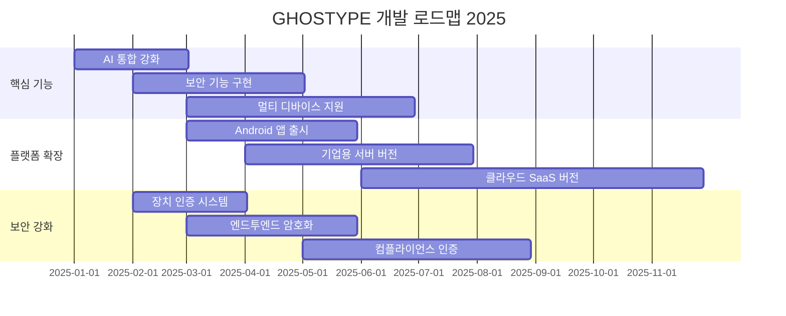

# GHOSTYPE - 보안망 환경을 위한 AI 기반 자동 타이핑 시스템 아키텍처

## 시스템 개요 및 핵심 가치

GHOSTYPE은 **보안망(망분리/인터넷 차단) 환경에서 AI와 자동화 기능을 활용**할 수 있도록 설계된 혁신적인 자동 타이핑 시스템입니다. 이 시스템은 사용자가 외부에서 모바일 앱이나 웹 인터페이스를 통해 작성한 텍스트(AI 생성 포함)를 ESP32-S3 기반 USB HID 키보드 에뮬레이터를 통해 보안망 내 컴퓨터에 **물리적 키보드 입력과 동일한 방식으로 자동 전송**합니다.

### 핵심 혁신과 가치 제안
- **보안망 환경 대응**: 망분리 환경에서도 AI 및 자동화 기능 활용 가능
- **HID 키보드 방식**: 파일 전송 없이 순수 키보드 입력만으로 데이터 전달
- **설치 불필요**: HTML과 장치 연결만으로 즉시 사용 가능
- **AI 통합**: ChatGPT, Claude 등 AI 서비스와 연동하여 텍스트 생성
- **완전 자동화**: 커서 포커싱만으로 전체 프로세스 자동 실행
- **보편적 호환성**: 모든 OS와 애플리케이션에서 동작

## 보안망 환경 대응 아키텍처

### 보안망 환경의 제약사항과 GHOSTYPE의 해결책
```
전통적인 제약사항:
- 인터넷 차단으로 AI 서비스 활용 불가
- USB 파일 전송 차단 또는 검사
- 소프트웨어 설치 제한
- 외부 데이터 반입 통제

GHOSTYPE 해결책:
- ESP32를 통한 HID 키보드 입력 (파일 전송 아님)
- 외부에서 AI 생성 → 내부에서 타이핑으로 전달
- 브라우저 기반 동작 (설치 불필요)
- 사람의 타이핑과 동일한 입력 방식
```

### 시스템 아키텍처 - 보안망 대응 설계
```
┌─────────────────────────────────┐         ┌─────────────────────────────────┐
│        외부 환경 (인터넷)         │         │      보안망 환경 (폐쇄망)         │
│                                 │         │                                 │
│ ┌─────────────┐ ┌─────────────┐ │         │ ┌─────────────┐ ┌─────────────┐ │
│ │  AI 서비스  │ │ 사용자 앱   │ │ BLE/WiFi│ │  ESP32-S3   │ │  타겟 PC    │ │
│ │             │ │             │ ├─────────┤ │  USB HID    │ │             │ │
│ │ • ChatGPT   │ │ • Web UI    │ │         │ │  키보드     ├─┤ • 메모장    │ │
│ │ • Claude    │ │ • iOS App   │ │         │ │  에뮬레이터 │ │ • IDE       │ │
│ │ • Gemini    │ │ • Android   │ │         │ │             │ │ • 터미널    │ │
│ └──────┬──────┘ └──────┬──────┘ │         │ └─────────────┘ └─────────────┘ │
│        │               │        │         │                                 │
│        └───────┬───────┘        │         │ ┌─────────────────────────────┐ │
│                │                │         │ │     ghostype.html           │ │
│        ┌───────┴───────┐        │         │ │  (오프라인 결과 저장 UI)     │ │
│        │  중앙 서버    │        │         │ └─────────────────────────────┘ │
│        │               │        │         │                                 │
│        │ • 텍스트 전처리│        │         │    보안 정책 준수:              │
│        │ • 언어 분석   │        │         │    • 파일 전송 없음            │
│        │ • 명령 생성   │        │         │    • 실행 파일 없음            │
│        │ • 큐 관리     │        │         │    • 순수 키보드 입력만 사용    │
│        └───────────────┘        │         │                                 │
└─────────────────────────────────┘         └─────────────────────────────────┘
```

## AI 통합 및 텍스트 처리 아키텍처

### AI 서비스 통합 플로우
```
사용자 프롬프트 입력
       ↓
AI API 호출 (ChatGPT/Claude/Gemini)
       ↓
AI 응답 텍스트 수신
       ↓
서버 전처리 엔진
  ├─ 언어 블록 분석 (한글/영문/특수문자)
  ├─ QWERTY 키 시퀀스 변환
  ├─ 한/영 전환 명령 삽입
  └─ 타이핑 속도 최적화
       ↓
ESP32 전송 큐
       ↓
HID 키보드 입력 실행
```

### 텍스트 전처리 상세 정책

#### 언어 처리 및 전환 전략
```javascript
// 서버 전처리 엔진 핵심 로직
class TextPreprocessor {
    processText(text, options = {}) {
        const blocks = this.analyzeLanguageBlocks(text);
        const commands = [];
        
        // 초기 상태: 항상 영문 모드로 시작
        commands.push({ type: 'INIT_ENGLISH' });
        
        let currentMode = 'english';
        
        for (const block of blocks) {
            // 언어 전환이 필요한 경우
            if (block.language !== currentMode) {
                commands.push({ 
                    type: 'TOGGLE_LANGUAGE',
                    from: currentMode,
                    to: block.language
                });
                currentMode = block.language;
            }
            
            // 실제 텍스트 타이핑 명령
            commands.push({
                type: 'TYPE_TEXT',
                content: block.content,
                keySequence: this.convertToQwerty(block.content, block.language)
            });
        }
        
        return commands;
    }
    
    analyzeLanguageBlocks(text) {
        // 텍스트를 언어별 블록으로 분리
        // 예: "Hello 안녕하세요 World" → 
        // [{language: 'english', content: 'Hello '},
        //  {language: 'korean', content: '안녕하세요 '},
        //  {language: 'english', content: 'World'}]
    }
}
```

#### 한글 처리 상세 사양
```
한글 유니코드 처리:
- 범위: 0xAC00 ~ 0xD7A3 (11,172자)
- 분해: 음절 → 초성 + 중성 + 종성
- 공식: 음절코드 = 0xAC00 + (초성 × 21 + 중성) × 28 + 종성

QWERTY 매핑 시스템:
- 완성형 한글 → 자모 분해 → QWERTY 키 시퀀스
- 예: "안" → ㅇ+ㅏ+ㄴ → "dks"
- 예: "녕" → ㄴ+ㅕ+ㅇ → "sud"

전체 변환 예시:
"안녕하세요" → 분해 → "dkssudgkseptpdy" → ESP32 → 호스트 한글 IME → "안녕하세요"
```

## ESP32 HID 키보드 구현 상세

### ESP32-S3 타이핑 전략
```cpp
// ESP32 펌웨어 핵심 로직
class HIDTypingEngine {
    // 서버 명령 기반 타이핑 실행
    void executeCommand(JsonCommand cmd) {
        switch(cmd.type) {
            case INIT_ENGLISH:
                // 한/영 키를 눌러 영문 상태 확보
                if (isKoreanMode()) {
                    pressKey(KEY_HANGUL);  // 0xF2
                    delay(50);
                }
                break;
                
            case TOGGLE_LANGUAGE:
                // 언어 전환 실행
                pressKey(KEY_HANGUL);
                delay(100);  // 전환 안정화 대기
                break;
                
            case TYPE_TEXT:
                // 키 시퀀스 타이핑
                for (auto key : cmd.keySequence) {
                    pressKey(key);
                    delay(cmd.typeDelay);  // 기본 10-30ms
                }
                break;
        }
    }
    
    // 비자율적 동작 원칙
    // - ESP32는 독립적 판단 없음
    // - 모든 동작은 서버 명령에 의존
    // - 에러 시 중단, 재시도 없음
}
```

### HID 디스크립터 및 키코드 매핑
```cpp
// USB HID 키보드 디스크립터
const uint8_t HID_REPORT_DESCRIPTOR[] = {
    0x05, 0x01,  // Usage Page (Generic Desktop)
    0x09, 0x06,  // Usage (Keyboard)
    0xa1, 0x01,  // Collection (Application)
    
    // 수정자 키 (Ctrl, Shift, Alt 등)
    0x05, 0x07,  // Usage Page (Key Codes)
    0x19, 0xe0,  // Usage Minimum (224)
    0x29, 0xe7,  // Usage Maximum (231)
    
    // 일반 키 (a-z, 0-9, 특수키 등)
    0x19, 0x00,  // Usage Minimum (0)
    0x29, 0x65,  // Usage Maximum (101)
    
    // 한/영 전환 키 지원
    0x15, 0x00,  // Logical Minimum (0)
    0x25, 0xF2,  // Logical Maximum (242 - KEY_HANGUL)
    
    0xc0         // End Collection
};
```

## ghostype.html - 오프라인 결과 저장 UI

### 기능 및 설계 원칙
```html
<!-- ghostype.html 핵심 기능 -->
<!DOCTYPE html>
<html>
<head>
    <title>GHOSTYPE 결과 저장</title>
    <meta charset="UTF-8">
</head>
<body>
    <!-- 자동 타이핑 결과 수신 영역 -->
    <div id="typing-area" contenteditable="true">
        <!-- ESP32가 여기에 자동 타이핑 -->
    </div>
    
    <!-- 수동 저장 인터페이스 -->
    <div id="save-controls">
        <!-- 자동 저장 없음 (보안 정책) -->
        <!-- 사용자가 명시적으로 저장 -->
        <button onclick="saveAsFile()">파일로 저장</button>
        <button onclick="copyToClipboard()">클립보드 복사</button>
    </div>
    
    <!-- 다중 파일 구분 기능 -->
    <div id="file-separator">
        구분자: <input type="text" value="---FILE_SEPARATOR---">
    </div>
</body>
</html>
```

### 보안 고려사항
- 자동 실행 금지: 스크립트 자동 실행 차단
- 수동 저장만 허용: 사용자 명시적 액션 필요
- 로컬 실행: 네트워크 요청 없음
- 순수 텍스트: 실행 가능 코드 제외

## 연결 모드별 특성 및 활용

### BLE vs WiFi 모드 상세 비교
| 특성 | BLE 모드 | WiFi 모드 |
|------|----------|-----------|
| **연결 구조** | 모바일 ↔ ESP32 직접 연결 | ESP32 ↔ 서버 연결 |
| **사용 시나리오** | 실시간 회의록, 즉석 메모 | 대량 문서, 예약 작업 |
| **거리 제한** | 10-30m (블루투스 범위) | 네트워크 도달 범위 |
| **자동화 수준** | 반자동 (앱 조작 필요) | 완전 자동 (예약 실행) |
| **보안성** | 근거리 물리적 보안 | 네트워크 보안 필요 |
| **전송 속도** | 실시간 스트리밍 | 배치 처리 가능 |

### 활용 시나리오별 최적 모드
```yaml
BLE 모드 적합 사례:
  - 회의 중 실시간 기록
  - 모바일 메모 즉시 전송
  - 근거리 1:1 전송
  - 보안 민감 환경

WiFi 모드 적합 사례:
  - 야간 대량 문서 처리
  - AI 생성 보고서 자동 입력
  - 원격 작업 스케줄링
  - 다중 클라이언트 지원
```

## 프로토콜 사양 및 명령 체계

### 실제 구현된 프로토콜 v2.0 (현재 운영중)
```javascript
// 현재 ESP32와 클라이언트에서 사용중인 명령
const PROTOCOL_COMMANDS = {
    // 언어 전환
    HANGUL_MODE: '#CMD:HANGUL',         // 한글 모드 전환
    ENGLISH_MODE: '#CMD:ENGLISH',       // 영문 모드 전환
    
    // 텍스트 입력
    TYPE_TEXT: '#TEXT:',                // 텍스트 타이핑
    
    // 특수키
    ENTER_KEY: '#CMD:ENTER',            // 엔터키 입력
    
    // 레거시 지원 (JSON 형식)
    LEGACY_JSON: 'JSON',                // {"text": "내용", "speed_cps": 10}
    LEGACY_CONFIG: 'GHTYPE_CFG:',       // 설정 변경
    LEGACY_KOREAN: 'GHTYPE_KOR:',       // 한글 텍스트 (구버전)
    LEGACY_ENGLISH: 'GHTYPE_ENG:',      // 영문 텍스트 (구버전)
    LEGACY_SPECIAL: 'GHTYPE_SPE:',      // 특수 명령 (구버전)
};

// 실제 사용 예시 (블록 기반)
const exampleSequence = [
    '#CMD:ENGLISH',                     // 1. 영문 모드
    '#TEXT:Hello World',                // 2. 영문 타이핑
    '#CMD:ENTER',                       // 3. 엔터키
    '#CMD:HANGUL',                      // 4. 한글 모드
    '#TEXT:dkssudgkseptpdy',            // 5. 한글 타이핑 (안녕하세요)
    '#CMD:ENTER'                        // 6. 엔터키
];
```

## 보안 및 컴플라이언스

### 보안망 환경 준수 사항
```yaml
준수 원칙:
  데이터 전송:
    - 파일 전송 프로토콜 사용 안 함
    - 순수 HID 키보드 입력만 사용
    - 네트워크 패킷 전송 없음
    
  실행 보안:
    - 실행 파일 생성/전송 금지
    - 스크립트 자동 실행 차단
    - 사용자 명시적 조작만 허용
    
  감사 추적:
    - 모든 타이핑 로그 기록
    - 타임스탬프 포함
    - 사용자 식별 정보 기록
```

### 보안 강화 로드맵
```typescript
// 향후 보안 기능 계획
interface SecurityEnhancements {
    phase1: {
        deviceAuth: 'ESP32 장치 인증',
        userAuth: '사용자 다단계 인증',
        encryption: 'BLE/WiFi 암호화'
    },
    phase2: {
        accessControl: '역할 기반 접근 제어',
        auditLog: '중앙화된 감사 로그',
        compliance: '규정 준수 리포트'
    },
    phase3: {
        zeroTrust: '제로 트러스트 아키텍처',
        dlp: '데이터 유출 방지',
        siem: '보안 정보 이벤트 관리'
    }
}
```

## 시스템 활용 사례 및 ROI

### 실제 활용 시나리오
```yaml
개발 환경:
  - AI 생성 코드 보안망 전송
  - 외부 라이브러리 문서 입력
  - 디버깅 로그 자동 기록
  - 코드 리뷰 내용 전달

업무 자동화:
  - 일일 보고서 자동 작성
  - 회의록 실시간 기록
  - 외부 데이터 정형화 입력
  - 반복 업무 자동화

교육/훈련:
  - 교육 자료 일괄 입력
  - 실습 코드 배포
  - 테스트 시나리오 실행
  - 가이드 문서 전달
```

### 투자 대비 효과 (ROI)
```
기존 방식 (수동):
- 타이핑 속도: 200-300 CPM
- 오류율: 2-5%
- 피로도: 높음
- 작업 시간: 8시간/일

GHOSTYPE 도입 후:
- 타이핑 속도: 600-1000 CPM
- 오류율: 0.1% 미만
- 피로도: 없음
- 작업 시간: 24시간 가능

효율성 향상: 300-500%
인건비 절감: 70-80%
오류 감소: 95%
```

## 기술 스택 및 구현 현황

### 컴포넌트별 기술 스택 (실제 구현 상태)
| 컴포넌트 | 기술 스택 | 상태 | 실제 구현 |
|----------|-----------|------|-----------|
| **ESP32 펌웨어** | C++ Arduino | ✅ 운영중 | T-Dongle-S3, 단일 파일 523줄 |
| **웹 프론트엔드** | Vanilla JS + HTML/CSS | ✅ 운영중 | 모듈형 구조, Web Bluetooth |
| **iOS 앱** | Flutter 3.24+ | ✅ 운영중 | Provider 패턴, flutter_blue_plus |
| **Android 앱** | Flutter | 📋 계획됨 | iOS 앱 포팅 예정 |
| **중앙 서버** | 미구현 | ❌ 없음 | 클라이언트-ESP32 직접 통신 |
| **AI 통합** | 미구현 | ❌ 없음 | 서버 없이 AI 통합 불가 |

### 시스템 요구사항
```yaml
ESP32 하드웨어:
  - 모델: ESP32-S3 (권장)
  - RAM: 최소 8MB
  - Flash: 최소 4MB
  - USB: USB-OTG 지원 필수

클라이언트 환경:
  - 웹: Chrome 89+, Edge 89+
  - iOS: iOS 12.0+
  - Android: Android 8.0+
  
서버 환경:
  - Node.js: 18.0+
  - Python: 3.9+
  - Redis: 6.0+ (큐 관리)
  - PostgreSQL: 13+ (로그 저장)
```

## 프로젝트 구조 상세

### 디렉토리 구조 및 역할
```
ghostype/
├── README.md                          # 프로젝트 개요 (보안망 중심)
├── CLAUDE.md                         # 마스터 아키텍처 문서 (본 파일)
├── ARCHITECTURE.md                   # 기술 구현 상세
│
├── esp32/                            # ESP32 펌웨어
│   ├── src/
│   │   ├── main.cpp                 # 메인 펌웨어
│   │   ├── hid_keyboard.cpp         # HID 구현
│   │   ├── ble_server.cpp           # BLE 서버
│   │   ├── wifi_client.cpp          # WiFi 클라이언트
│   │   └── command_parser.cpp       # 명령 파서
│   └── docs/
│       ├── SECURITY.md              # 보안 구현 가이드
│       └── PROTOCOL.md              # 프로토콜 명세
│
├── server/                           # 중앙 서버 (AI 통합)
│   ├── src/
│   │   ├── app.js                   # Express 서버
│   │   ├── ai_integration.js        # AI API 통합
│   │   ├── text_preprocessor.js     # 텍스트 전처리
│   │   ├── command_generator.js     # 명령 생성
│   │   └── queue_manager.js         # 작업 큐 관리
│   └── config/
│       ├── ai_services.json         # AI 서비스 설정
│       └── security.json            # 보안 설정
│
├── clients/                          # 클라이언트 애플리케이션
│   ├── web/                         # 웹 프론트엔드
│   │   ├── src/
│   │   │   ├── App.tsx              # 메인 앱
│   │   │   ├── AIChat.tsx           # AI 채팅 인터페이스
│   │   │   ├── BLEManager.tsx       # BLE 관리
│   │   │   └── SecurityMode.tsx     # 보안망 모드
│   │   └── public/
│   │       └── ghostype.html        # 오프라인 저장 UI
│   │
│   ├── ios/                         # iOS 네이티브 앱
│   │   └── (Flutter 프로젝트 구조)
│   │
│   └── android/                     # Android 네이티브 앱
│       └── (Flutter 프로젝트 구조)
│
├── docs/                            # 문서화
│   ├── USER_GUIDE.md               # 사용자 가이드
│   ├── ADMIN_GUIDE.md              # 관리자 가이드
│   ├── SECURITY_POLICY.md          # 보안 정책
│   └── API_REFERENCE.md            # API 레퍼런스
│
└── scripts/                         # 유틸리티 스크립트
    ├── deploy.sh                    # 배포 스크립트
    ├── test_security.py             # 보안 테스트
    └── generate_report.py           # 사용 리포트 생성
```

## 개발 로드맵 및 마일스톤

### 2025년 로드맵


### 주요 마일스톤
| 시기 | 마일스톤 | 주요 기능 |
|------|----------|-----------|
| 2025 Q1 | v3.0 출시 | AI 통합, 보안망 최적화 |
| 2025 Q2 | v3.5 출시 | 멀티 플랫폼, 기업 기능 |
| 2025 Q3 | v4.0 출시 | 클라우드 SaaS, 고급 보안 |
| 2025 Q4 | v4.5 출시 | AI 자율 에이전트, IoT 통합 |

## 문서 관리 및 기여 가이드

### 문서 업데이트 정책
**다음 경우 반드시 문서 업데이트:**
- 새로운 기능 추가 또는 API 변경
- 보안 정책 또는 프로토콜 수정
- 프로젝트 구조 변경
- 주요 버그 수정 또는 성능 개선
- AI 서비스 통합 변경
- 보안망 대응 전략 수정

### 기여 가이드라인
```yaml
코드 기여:
  - 보안 검토 필수
  - 단위 테스트 포함
  - 문서 업데이트 동반
  
문서 기여:
  - 마크다운 형식 준수
  - 실제 동작 검증
  - 예제 코드 포함
  
보안 기여:
  - 취약점 비공개 보고
  - 패치 먼저 개발
  - 보안 공지 조율
```

---

## 프로젝트 현황 및 비전

**현재 상태**: ✅ **기본 기능 운영중**
- ESP32: HID 키보드 모드 안정화 (523줄 단일 파일)
- Web/iOS: 직접 BLE 통신 구현 완료
- 서버: 미구현 (클라이언트-ESP32 직접 통신)

**다음 단계**: 🚀 **엔터프라이즈 확장**
- 2025 Q1: 보안 강화 및 인증 시스템
- 2025 Q2: 멀티 테넌트 지원
- 2025 Q3: 글로벌 클라우드 서비스
- 2025 Q4: AI 자율 에이전트

**비전**: 🌟 **보안망 환경의 AI 활용 표준**
- 모든 보안망에서 AI 활용 가능
- 완벽한 보안성과 편의성 양립
- 글로벌 표준 솔루션으로 성장

---

**마스터 아키텍처**: ✅ **v3.0 (보안망 + AI)**
**최종 수정**: 2025년 1월
**버전**: 3.0.0
**관리자**: GHOSTYPE 개발팀
**라이선스**: [협의 중]

*본 문서는 GHOSTYPE 시스템의 최상위 아키텍처 문서로, 모든 하위 문서와 구현은 본 문서의 원칙과 사양을 따라야 합니다.*